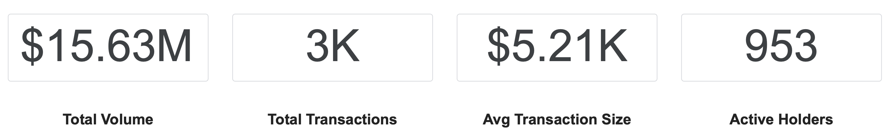
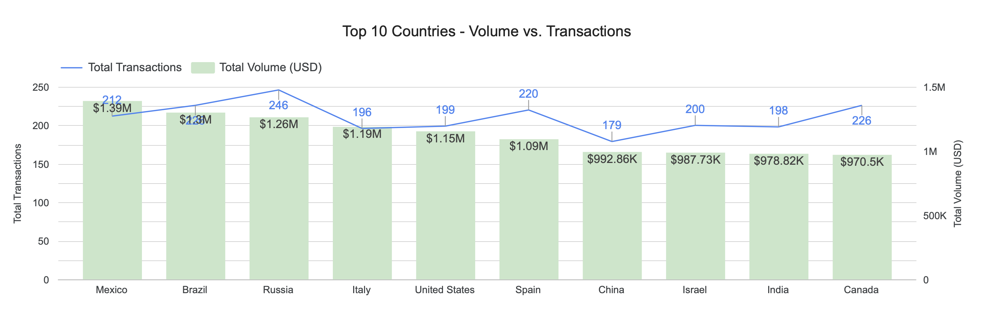
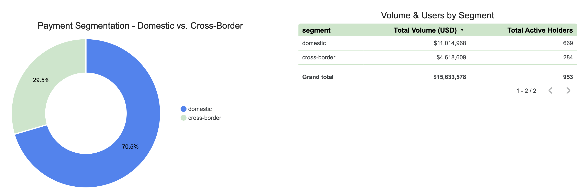
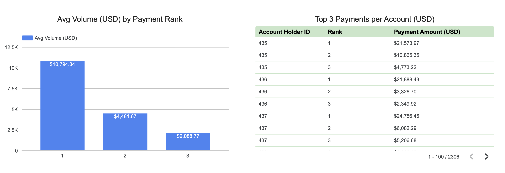

# Senior BI Developer — Payoneer Home Assignment

> *End-to-end BI solution built on BigQuery. Covers data assurance, USD normalization, geographic and cross-border segmentation, top payments per account, and a month-over-month portfolio trend — delivered as SQL scripts and a Looker Studio dashboard.*

---

## Table of Contents

- [Source Files](#source-files)
- [Load Data](#load-data)
- [Part 1 — Written Analysis](#part-1--written-analysis)
- [Part 2 — SQL Script](#part-2--sql-script)
  - [Goal A — Data Assurance](#goal-a--data-assurance)
  - [Goal B — USD Normalization](#goal-b--usd-normalization)
  - [Goal C — Top 10 Countries by Volume](#goal-c--top-10-countries-by-volume)
  - [Goal D — Cross-border vs Not Cross-border](#goal-d--cross-border-vs-not-cross-border)
  - [Goal E — Top Three Payments per Account](#goal-e--top-three-payments-per-account)
  - [Goal F — Month-over-Month Portfolio Trend](#goal-f--month-over-month-portfolio-trend-optional)
- [Part 3 — Looker Studio Dashboard](#part-3--looker-studio-dashboard)

---

## Source Files


| File                      | BigQuery Table                         | Rows  | Description                          |
| ------------------------- | -------------------------------------- | ----- | ------------------------------------ |
| `fact_Payments.csv`       | `payoneer_dev_raw.fact_Payments`       | 3,000 | Payments — one row per payment       |
| `dim_AccountHolder.csv`   | `payoneer_dev_raw.dim_AccountHolder`   | 1,000 | Account holders and their attributes |
| `dim_Countries.csv`       | `payoneer_dev_raw.dim_Countries`       | 104   | Country codes and names              |
| `dim_Currency_Quotes.csv` | `payoneer_dev_raw.dim_Currency_Quotes` | 3,210 | FX rates by currency pair and date   |


---

## Data Loading & Production Architecture Strategy

For this assignment, the CSV files were loaded directly into a BigQuery raw dataset. However, in a real-world dbt production environment, the modeling strategy would be tailored to each table's behavior:

| Table | Production Strategy |
|:------|:-------------------|
| `dim_Countries` | Managed as a dbt seed since it is highly static reference data, updated only via version control. |
| `fact_Payments` & `dim_Currency_Quotes` | Configured as materialized incremental models (partitioned by date) for efficient, append-only daily processing. |
| `dim_AccountHolder` (SCD Type 2) | Customer attributes change over time. Overwriting their location history (SCD Type 1) would corrupt historical regulatory reporting. I would manage this using dbt snapshots (SCD Type 2). Since the source lacks timestamp columns, I would utilize dbt's check strategy on CountryID and City to automatically track changes and generate valid_from / valid_to dates. |

---

## Part 1 — Written Analysis

### 1. FX Matching

The full join condition is:

```sql
left join dim_Currency_Quotes q
    on  q.buycurrency = 'USD'
    and q.sellcurrency = p.currency
    and parse_date('%d-%b-%Y', q.quotetime) = p.paymentdate
```

Three conditions are required: `buycurrency = 'USD'` selects the USD-base rows per the FX convention; `sellcurrency = p.currency` matches the payment currency; and the parsed date matches the payment date.

**What failed first**

The initial join on `p.paymentdate = q.quotetime` raised a type error at compile time — BigQuery does not allow comparing a `DATE` to a `STRING` directly:


| Table                 | Column        | Type     | Example       |
| --------------------- | ------------- | -------- | ------------- |
| `fact_payments`       | `paymentdate` | `DATE`   | `2025-06-01`  |
| `dim_currency_quotes` | `quotetime`   | `STRING` | `01-Jun-2025` |


**How it was fixed**

`quotetime` is parsed into a `DATE` before joining using `PARSE_DATE('%d-%b-%Y', quotetime)`. Coverage was verified by running a `LEFT JOIN` and counting rows where `amount_usd IS NULL` — the result was zero, confirming **3,000 out of 3,000 payments** matched an FX rate.

**Edge cases:** In production, FX rates are typically not published on weekends or public holidays, which would leave payments on those dates without a rate. In that case the fallback is to use the most recent available rate on or before the payment date — this is documented as Option 2 in [Goal B](#goal-b--usd-normalization). In this dataset that risk does not apply — the coverage check confirmed zero gaps across all currencies and dates, including weekends. No currencies appear in `fact_Payments` that are absent from `dim_Currency_Quotes`, and no `PaymentDate` values fall outside the FX date range.

For the full technical implementation and join strategy see [Goal B — USD Normalization](#goal-b--usd-normalization).

### 2. Finance Assumptions

- **Field used:** `CountryID` — described in the assignment as country of residence.
Reporting jurisdiction follows where a person currently resides: residence determines tax domicile, regulatory oversight, and reporting obligations. For CRS specifically, reporting follows the account holder's tax residence — making `CountryID` the correct field. FATCA reporting is determined by US tax residency, not birth country, which further supports this choice. The data confirms both fields capture independent attributes: there are holders where `CountryID != BirthCountryID` (e.g., AccountHolderID 436), meaning the two fields are not interchangeable. This choice is an assumption pending Legal validation — not a final regulatory conclusion.
- **Field not used:** `BirthCountryID` — country of birth.
Birth country is a static, immutable attribute that does not reflect where a person lives or which authority has jurisdiction over their payments. A person born in one country but residing in another falls under the jurisdiction of their residence country. Using birth country would misrepresent regulatory exposure.
- **What I would ask Legal or Compliance before real regulatory use:**
  - Does our reporting obligation follow the account holder's **residence** or their **birth country or current nationality** — and does `CountryID` capture residence specifically, or the country provided at registration?
  - For cross-border standards such as CRS, are there cases where **both** countries must be reported?
  - **Is `CountryID` a point-in-time snapshot or a slowly-changing dimension?** If a customer relocates, is the previous value preserved or overwritten — and should we report based on residence at the time of the transaction or current residence?
  - **What is the regulatory policy for missing or invalid data?** How should we classify and report transactions where `CountryID` is NULL or unrecognized?

---

## Part 2 — SQL Script

### Goal A — Data Assurance

27 tests validate the integrity of all four tables before any transformation is built on top of them. Tests cover:


| Type                       | What it checks                                                                     |
| -------------------------- | ---------------------------------------------------------------------------------- |
| Uniqueness                 | Primary keys contain no duplicates                                                 |
| Not null                   | All key and measure columns are populated                                          |
| Referential integrity      | Every FK value exists in the referenced table                                      |
| Composite uniqueness       | One FX rate per currency per day                                                   |
| Allowed values             | `BuyCurrency` is always `USD` — enforces the FX convention all goals depend on     |
| Value range                | `Amount > 0` — rejects negative or zero values that would corrupt USD aggregations |


**Relationship chain validated:** `payment → holder → residence country`, `holder → birth country`, `payment → FX rate (currency + date)`.

Two join risks were explicitly tested and resolved:

- **Fan-out risk:** confirmed `(SellCurrency, QuoteTime)` is unique under `BuyCurrency = 'USD'`, so the Goal B `LEFT JOIN` cannot multiply payment rows.
- **FX coverage:** confirmed every `(currency, paymentdate)` pair in `fact_Payments` has a matching USD rate — 0 unconverted payments.

Full SQL: [analysis/goal_a_data_assurance.sql](analysis/goal_a_data_assurance.sql)

All 27 tests passed.


| Table                 | Tests  | Failures |
| --------------------- | ------ | -------- |
| `dim_Countries`       | 3      | 0        |
| `dim_AccountHolder`   | 9      | 0        |
| `dim_Currency_Quotes` | 6      | 0        |
| `fact_Payments`       | 9      | 0        |
| **Total**             | **27** | **0**    |


### Goal B — USD Normalization

Each payment is converted to USD using the FX rate for its currency on its payment date.

- **Convention:** `dim_currency_quotes` rows where `buycurrency = 'USD'`
- **Rate:** `ratemid` = units of payment currency per 1 USD
- **Formula:** `amount_usd = amount / ratemid`

> The date format mismatch between tables and how it was resolved is documented in [Part 1 — FX Matching](#1-fx-matching).

**Two join strategies**

**Option 1 — Exact date join** *(used for this dataset)*

Joins each payment to the FX rate on the exact payment date.
Works here because coverage check confirmed **0 missing dates** across all currencies.

```sql
left join fx
    on  p.currency = fx.sellcurrency
    and p.paymentdate = fx.quote_date
```

**Option 2 — Last known rate** *(production-safe fallback)*

If no rate exists for the exact date, falls back to the most recent available rate on or before the payment date. In production, FX rates are not published on weekends or public holidays — payments on those dates would fail Option 1 and require this fallback. See [Part 1 — FX Matching](#1-fx-matching) for a full discussion of edge cases.

```sql
left join fx
    on  p.currency = fx.sellcurrency
    and fx.quote_date <= p.paymentdate
qualify row_number() over (partition by p.paymentid order by fx.quote_date desc) = 1
```

---

**Coverage:** All 3,000 payments converted successfully — 0 rows missing an FX rate.

---

**Architecture note — production-grade financial precision**

```sql
cast(p.amount as numeric) / nullif(fx.ratemid, 0) as amount_usd
```


| Decision                  | Why                                                                                                                                                               |
| ------------------------- | ----------------------------------------------------------------------------------------------------------------------------------------------------------------- |
| `NUMERIC` over `FLOAT64`  | `FLOAT64` uses binary approximation — errors compound across aggregations. `NUMERIC` guarantees exact decimal arithmetic, mandatory for monetary values.          |
| No `ROUND()` at row level | Rounding each row before aggregation causes errors to accumulate in downstream sums (Goal C, D). Rounding belongs at the presentation layer only.                 |
| `NULLIF(ratemid, 0)`      | A zero rate crashes the query with a division-by-zero exception. `NULLIF` converts it to `NULL`, returning a recoverable signal instead of aborting the pipeline. |


---

Full SQL: [analysis/goal_b_usd_normalization.sql](analysis/goal_b_usd_normalization.sql)

### Goal C — Top 10 Countries by Volume

Country is determined by `CountryID` (country of residence) from `dim_AccountHolder` — consistent with the rule defined in [Part 1 — Finance Assumptions](#2-finance-assumptions).


| Rank | Country       | Payments | Total USD  |
| ---- | ------------- | -------- | ---------- |
| 1    | Mexico        | 212      | $1,389,985 |
| 2    | Brazil        | 226      | $1,299,421 |
| 3    | Russia        | 246      | $1,262,890 |
| 4    | Italy         | 196      | $1,188,740 |
| 5    | United States | 199      | $1,153,515 |
| 6    | Spain         | 220      | $1,092,041 |
| 7    | China         | 179      | $992,860   |
| 8    | Israel        | 200      | $987,725   |
| 9    | India         | 198      | $978,824   |
| 10   | Canada        | 226      | $970,500   |


**Observation:** The top 10 span four continents (Americas, Europe, Asia) with only a 43% spread between first ($1.39M) and tenth ($0.97M), indicating a broad, non-concentrated portfolio with no single dominant market.

> Total USD values are rounded to the nearest dollar for display, ranking uses full-precision sums.

Full SQL: [analysis/goal_c_top10_countries.sql](analysis/goal_c_top10_countries.sql)

### Goal D — Cross-border vs Not Cross-border

**Definition:** Cross-border = account holder whose country of **residence** (`CountryID`) differs from their country of **birth** (`BirthCountryID`). This is a holder-level attribute, not a payment-routing classification.


| Segment      | Holders | Total USD   | Avg USD / Holder | Avg USD / Payment | Payments / Holder |
| ------------ | ------- | ----------- | ---------------- | ----------------- | ----------------- |
| Cross-border | 284     | $4,618,609  | $16,263          | $5,218            | 3.1               |
| Domestic     | 669     | $11,014,968 | $16,465          | $5,208            | 3.2               |


**Observation:** Cross-border holders are approximately 30% of the active base (284 of 953) and generate approximately 30% of total USD volume — their share is proportional to their count, with no disproportionate value concentration in either group. Average payment size and frequency are nearly identical across segments ($5,218 vs $5,208 per payment; 3.1 vs 3.2 payments per holder). Note: similar averages on this dataset do not rule out differences in distribution shape or variance.

Full SQL: [analysis/goal_d_cross_border.sql](analysis/goal_d_cross_border.sql)

### Goal E — Top Three Payments per Account

For each account holder, up to three largest payments by USD value — using the same FX conversion as Goal B (`amount_usd = amount / ratemid`, NUMERIC precision, exact date join). Goal A confirmed 0 unconverted payments, so `amount_usd` is never NULL.

**Ranking function:** `ROW_NUMBER()` — returns at most 3 rows per holder. Holders with fewer than 3 payments appear with only as many rows as they have. `DENSE_RANK()` would be appropriate if the goal were "all payments ranked in the top 3 positions," but this goal asks for up to three payments per holder.

**Tie-breaking rule:** When two payments share the same `amount_usd`, the most recent payment ranks first (`PaymentDate DESC`) — recency is the most natural business tiebreaker for a top-payments report. An alternative is `PaymentID ASC` alone (pure determinism, no business preference); `PaymentDate DESC` is chosen here because a more recent payment is a more meaningful "top" entry. `PaymentID ASC` is the secondary tiebreaker for same-date ties, guaranteeing full determinism.

**Sample output (illustrative — 2 holders shown; the full query returns all active holders):**


| AccountHolderID | Rank | PaymentID | PaymentDate | Amount    | Currency | Amount USD |
| --------------- | ---- | --------- | ----------- | --------- | -------- | ---------- |
| 435             | 1    | 65545958  | 2025-11-05  | 18,889.80 | CHF      | $21,573.97 |
| 435             | 2    | 65544321  | 2025-07-09  | 16,323.37 | AUD      | $10,865.35 |
| 435             | 3    | 65545726  | 2025-10-19  | 24,197.65 | BRL      | $4,773.22  |
| 436             | 1    | 65544386  | 2025-07-14  | 20,410.65 | EUR      | $21,888.43 |
| 436             | 2    | 65544528  | 2025-07-24  | 13,367.20 | PLN      | $3,326.70  |
| 436             | 3    | 65544810  | 2025-08-14  | 24,481.55 | SEK      | $2,349.92  |


> Holder 435, rank 3: original amount (24,197 BRL) converts to only $4,773 — a good illustration of why ranking in the original currency would produce a different and misleading result.

Full SQL: [analysis/goal_e_top3_per_account.sql](analysis/goal_e_top3_per_account.sql)

### Goal F — Month-over-Month Portfolio Trend

Total portfolio USD per calendar month, with month-over-month % change calculated using `LAG()`: 

`(curr - prev) / NULLIF(prev, 0) * 100`. `NULLIF` guards against division by zero if a prior month had zero volume.


| Month   | Payments | Total USD  | MoM % Change |
| ------- | -------- | ---------- | ------------ |
| 2025-06 | 423      | $1,978,979 | —            |
| 2025-07 | 428      | $2,266,811 | +14.54%      |
| 2025-08 | 413      | $2,397,427 | +5.76%       |
| 2025-09 | 443      | $2,200,206 | -8.23%       |
| 2025-10 | 417      | $2,218,618 | +0.84%       |
| 2025-11 | 432      | $2,221,647 | +0.14%       |
| 2025-12 | 444      | $2,349,889 | +5.77%       |


**Observation:** The portfolio grew strongly in July (+14.5%) and August (+5.8%), dipped in September (-8.2%), then stabilized through Q4 with modest single-digit growth. The overall trajectory is positive — the portfolio closed December at $2.35M, up approximately 19% from the June baseline of $1.98M.

Full SQL: [analysis/goal_f_mom_trend.sql](analysis/goal_f_mom_trend.sql)

---

## Part 3 — Looker Studio Dashboard

The dashboard visualises the findings from Part 2 in a single-page Looker Studio report connected to BigQuery dataset. It covers portfolio volume, geographic distribution, cross-border segmentation, top payments per holder, and month-over-month trend. Full dashboard: [Payoneer Global Volume & Segmentation Insights Dashboard.pdf](dashboard/Payoneer%20Global%20Volume%20%26%20Segmentation%20Insights%20Dashboard.pdf) 

### Tiles

**KPI Row — Portfolio Overview**
This primary scorecard provides an at-a-glance baseline of the portfolio's overall health and scale. It summarizes our absolute financial volume ($15.63M), operational velocity (3K transactions), and active user base (953 holders). Crucially, it highlights the Average Transaction Size ($5.21K), establishing a core benchmark for evaluating specific market behaviors before drilling down into regional or segment-level data.



---

**Top 10 Countries — Volume vs. Transactions (Goal C)**
This section identifies our top 10 geographic markets, contrasting total revenue generated against transaction volume. Plotting these metrics together reveals distinct market behaviors and proves that high transaction frequency doesn't always equate to higher monetary value. For example, while Brazil drives more individual transactions, Mexico generates a higher total USD volume, indicating a



---

**Payment Segmentation — Domestic vs. Cross-Border (Goal D)**
This section visualizes the strategic split between local and international user activity. The donut chart and accompanying table demonstrate a highly balanced portfolio: Cross-border accounts represent roughly 30% of our active user base (284 out of 953) and proportionally generate approximately 30% of the total USD volume ($4.6M out of $15.6M). You can use the global Segment filter to slice the entire dashboard and compare behavioral trends between these two distinct groups.



---

**Top 3 Payments per Account (Goal E)**
This section looks at the biggest transactions per user. The bar chart answers a simple question: Do our clients make large payments regularly, or just one huge payment followed by much smaller ones? The steep drop from Rank 1 to Rank 2 shows that our users typically make one extra-large transaction, rather than consistent, equally-sized payments. You can use the AccountHolderID filter to check this behavior for any specific client.



---

**MoM % Change and Total Volume by Month (Goal F)**
This section tracks the overall financial health and growth trajectory of the portfolio over the second half of 2025. By pairing absolute USD volume with the Month-over-Month (MoM) growth rate, it exposes critical business cycles—highlighting the sharp contraction in September (-8.2%) followed by steady stabilization and recovery throughout Q4. You can interact with the global filters (such as Country or Segment) to investigate what drove these specific market shifts.

.png)

